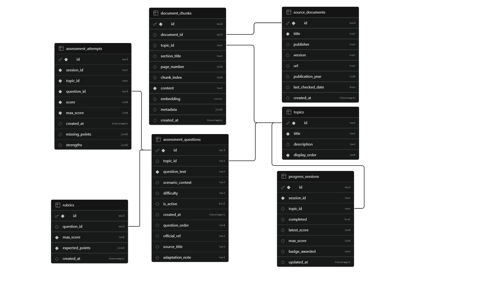

# Cyber Essentials Intelligent Tutoring System

A web-based Intelligent Tutoring System designed to support learning and preliminary readiness preparation for the UK Cyber Essentials framework.

The prototype combines retrieval-augmented AI tutoring, open-ended formative assessment, learner progress tracking and a structured readiness Consultation module.

> **Important:** This is an academic learning prototype. It is not an official Cyber Essentials certification platform and does not make compliance or certification decisions.

## Live Demo

**Prototype:** https://cyber-essentials-tutor.vercel.app/

The deployed frontend communicates with a FastAPI backend hosted on Render.

## Features

- **Cyber Essentials learning interface**  
  Browse the official Cyber Essentials requirements by control area.

- **RAG-based AI Tutor**  
  Ask natural-language questions and receive explanations grounded in retrieved Cyber Essentials content.

- **Open-ended formative assessment**  
  Complete scenario-based questions evaluated against predefined rubrics and retrieved reference material.

- **Progress and Weak Points**  
  Track mastery, XP and assessment progress, and review missing rubric points from incomplete answers.

- **Cyber Essentials Consultation**  
  Complete a shortened readiness questionnaire for a fictional or generalised organisation and receive rule-based strengths, potential gaps and recommended actions.

- **Explanation support**  
  Consultation questions include predefined explanations and optional constrained AI follow-up support.

## Architecture

```text
User
 │
 ▼
React + TypeScript Frontend
 │
 ▼
FastAPI Backend
 ├── Supabase PostgreSQL
 │    ├── Cyber Essentials document chunks
 │    ├── Assessment questions
 │    ├── Rubrics
 │    └── Pseudonymous assessment progress
 │
 └── Azure OpenAI
      ├── Text embeddings
      ├── AI Tutor
      ├── Formative assessment feedback
      └── Consultation summaries
```

The system uses different controls for different AI functions:

- Retrieval grounds AI Tutor responses in Cyber Essentials material.
- Predefined rubrics constrain formative assessment.
- Deterministic rules determine Consultation readiness findings.
- Generative AI is primarily used for explanation, feedback and summarisation.

## Technology Stack

| Layer | Technology |
|---|---|
| Frontend | React, TypeScript, Vite, React Bootstrap |
| Backend | Python, FastAPI |
| Database | Supabase PostgreSQL |
| Vector Search | Supabase vector embeddings |
| AI Services | Azure OpenAI |
| Frontend Hosting | Vercel |
| Backend Hosting | Render |
| Source Control | GitHub |

## Database

Supabase stores the Cyber Essentials knowledge base, assessment content and limited learner-progress metadata.

Main application tables include:

- `assessment_questions`
- `rubrics`
- `assessment_attempts`
- document and source tables used by the RAG knowledge base

The application does not persist raw AI Tutor conversations, raw assessment answers or raw Consultation responses.

### Database Schema



## Project Structure

```text
.
├── backend/
│   ├── main.py
│   ├── requirements.txt
│   └── app/
│       ├── api/
│       │   ├── chat.py
│       │   ├── assessment.py
│       │   ├── progress.py
│       │   └── consultation.py
│       └── core/
│
├── frontend/
│   ├── package.json
│   └── src/
│
└── README.md
```

## Local Development

### Backend

```bash
cd backend
pip install -r requirements.txt
uvicorn main:app --reload --host 127.0.0.1 --port 8000
```

The backend normally runs at:

```text
http://127.0.0.1:8000
```

### Frontend

```bash
cd frontend
npm install
npm run dev
```

The frontend normally runs at:

```text
http://localhost:5173
```

## Environment Variables

The backend requires configuration for Supabase and Azure OpenAI:

```env
SUPABASE_URL=
SUPABASE_SERVICE_ROLE_KEY=

AZURE_OPENAI_BASE_URL=
AZURE_OPENAI_API_KEY=
AZURE_OPENAI_CHAT_DEPLOYMENT=
AZURE_OPENAI_EMBEDDING_DEPLOYMENT=
```

The frontend requires:

```env
VITE_API_BASE_URL=
```

Do not commit real API keys, passwords or service-role credentials to the repository.

## Privacy and Data Handling

The prototype uses a randomly generated browser session ID for limited learner-progress tracking.

Stored assessment metadata includes:

- Topic ID
- Question ID
- Score
- Maximum score
- Strengths
- Missing rubric points
- Timestamp

The application is designed not to persist:

- Raw AI Tutor conversations
- Raw assessment answers
- Raw Consultation responses
- Consultation help conversations
- Clarification help conversations

Users should not enter real confidential organisational information, personal information, passwords, credentials, IP addresses or sensitive security configurations.

## Limitations

This prototype:

- is not an official Cyber Essentials certification platform;
- does not replace a Certification Body;
- does not perform technical scanning or auditing;
- does not provide Cyber Essentials Plus testing;
- does not guarantee certification readiness;
- uses a shortened Consultation workflow rather than the official self-assessment questionnaire;
- uses generative AI only as learning and explanatory support.

## Academic Context

This system was developed as part of an MSc Cyber Security Management dissertation investigating how an AI-driven Intelligent Tutoring System can support Cyber Essentials learning and preliminary readiness guidance for small enterprise IT teams.
